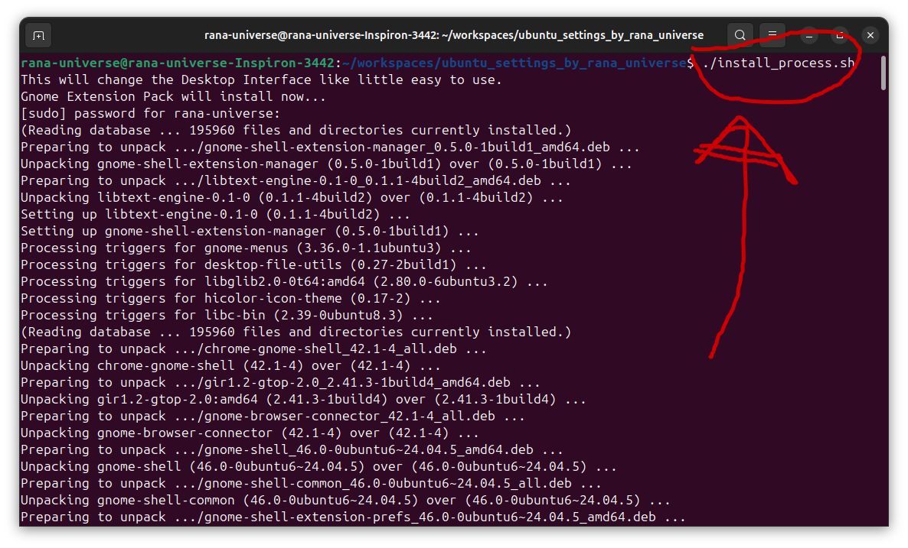

# Ubuntu 24.04 LTS

Same As: 
```git clone https://github.com/RanaUniverse/u1```

[Guide For Download Iso File](z_extra_rana_universe/iso_file_download_page.md)

I think rather than install new version of os i will use apt upgrade after install 24.04

This Branch is currenty Tested for only 24.04, future versions of ubuntu maybe have some dependencies problem.

This i just need to run the **./install_process.sh** file which depends on the other folders files and configuration. 
so i need to change a little information in the other directories.

I just need to clone this and then run the above command to complete all things.


After i install this with ./install_process.sh then i need to manually add the .bashrc file content so that i can get the my own terminal shortcut.

I need to use the [Terminal Shortcut File](00_important_files/alias_for_terminal.md)
